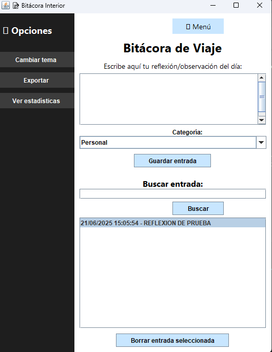
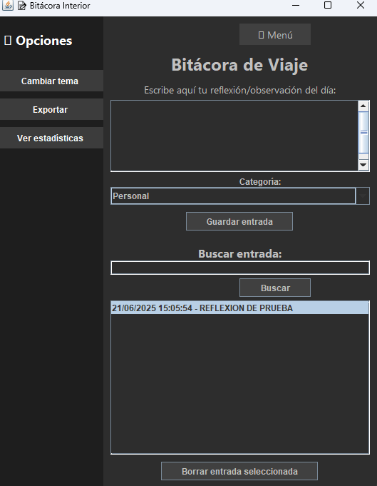

# 🗒️ Bitácora de Viaje

Aplicación de escritorio desarrollada en **Java** que permite registra ry gestionar entradas personales en una pequeña bitácora digital.

## ✨ Características 

- Añadir reflexiones u observaciones diarias.
- Clasificación por categoría: Personal, Espiritual, Estudios, etc.
- Búsqueda de entradas por texto.
- Eliminación de entradas seleccionadas.
- Exportación de registros.
- Estadísticas visuales del contenido registrado.
- Cambio dinámico de tema (claro/oscuro).

## 📚 Cómo usar

1. Clonar el repositorio.
2. Compilar y ejecutar el archivo principal (`BitacoraApp.java`).
3. Comenzar a registrar tus entradas desde la interfaz.

## 🎯 Objetivo

Este proyecto fue creado como una práctica de programación orientada a objetos con interfaz gráfica en Java, enfocado en la organización personal y el registro de experiencias.

## 🖼️ Capturas de pantalla

### Modo Claro

### Modo Oscuro

> 💡 El modo oscuro está integrado como una funcionalidad que mejora la experiencia visual y es activable desde el menú lateral.

## 🛠️ Tecnologías utilizadas

- **Java (Swing)** para la interfaz gráfica.
- **POO (Programación Orientada a Objetos)** como base de la estructura del código.
- Manejo de archivos txt para guardar entradas localmente.

---

Si querés ver el código fuente, podés visitar la carpeta `src/`.

---
